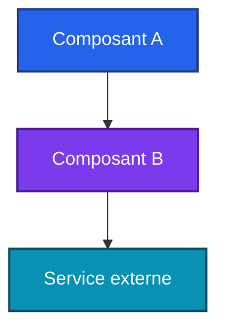

# REPO

<!-- adam-badges:start -->
[](https://github.com/Adam-Blf/REPO/commits)
[](https://hits.sh/github.com/Adam-Blf/REPO/)
[](https://github.com/Adam-Blf/REPO/commits)
[](https://github.com/Adam-Blf/REPO)
[](LICENSE)
<!-- adam-badges:end -->


Une phrase qui dit ce que fait le projet, pour qui, avec quelle stack.

## Features

- [ ] Feature 1
- [ ] Feature 2

## Architecture



## Stack

- Langage / framework principal
- Services externes (Supabase, Stripe, Vercel...)

## Demarrage

```bash
# installation
# lancement dev
```

## Variables d'environnement

| Variable | Description | Exemple |
|----------|-------------|---------|
| `EXEMPLE_KEY` | A quoi elle sert | `xxx` (jamais la vraie valeur) |

## Licence

MIT, voir [LICENSE](LICENSE).
